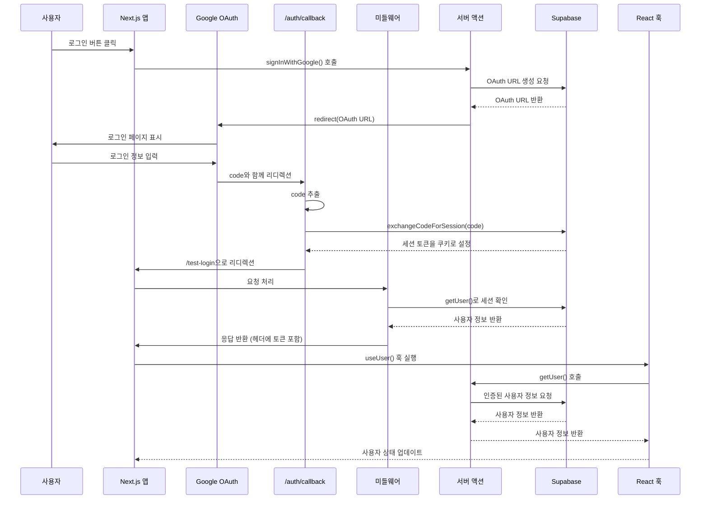

# Google 로그인 기능 흐름 분석

## 개요
이 문서는 Google OAuth를 통한 로그인 기능의 전체적인 흐름을 설명합니다.

## 로그인 흐름 다이어그램



## 상세 흐름 설명

### 1. 로그인 시작
- 사용자가 로그인 버튼을 클릭
- `app/actions/auth.ts`의 `signInWithGoogle()` 서버 액션이 호출됨
- Supabase OAuth URL을 생성하고 Google로 리디렉션

```typescript
// app/actions/auth.ts
export async function signInWithGoogle() {
  const supabase = await createClient();
  
  const { data, error } = await supabase.auth.signInWithOAuth({
    provider: "google",
    options: {
      redirectTo: `${process.env.NEXT_PUBLIC_SITE_URL}/auth/callback`,
    },
  });

  if (data.url) {
    redirect(data.url);
  }
}
```

### 2. Google OAuth 처리
- Google에서 사용자 인증 처리
- 인증 성공 후 `/auth/callback` 경로로 리디렉션
- URL에 `code` 파라미터가 포함됨

### 3. 콜백 처리
- `app/auth/callback/route.ts`가 실행됨
- URL에서 `code` 파라미터를 추출
- `supabase.auth.exchangeCodeForSession(code)`로 세션 토큰을 쿠키에 설정
- `/test-login` 페이지로 리디렉션

```typescript
// app/auth/callback/route.ts
export async function GET(request: Request) {
  const requestUrl = new URL(request.url);
  const code = requestUrl.searchParams.get('code');

  if (code) {
    const supabase = await createClient();
    await supabase.auth.exchangeCodeForSession(code);
  }

  return NextResponse.redirect(new URL('/test-login', requestUrl.origin));
}
```

### 4. 미들웨어 처리
- `middleware.ts`가 모든 요청을 가로챔
- `lib/supabase-middleware.ts`를 통해 Supabase 클라이언트 생성
- 쿠키에서 토큰을 읽어 헤더에 설정
- `supabase.auth.getUser()`로 세션 상태 확인

```typescript
// middleware.ts
export async function middleware(request: NextRequest) {
  const { supabase, response } = createClient(request);
  
  // 세션 새로고침
  await supabase.auth.getUser();
  
  return response;
}
```

### 5. 서버 액션을 통한 사용자 정보 조회
- `app/actions/auth.ts`의 `getUser()` 함수가 Supabase 클라이언트를 통해 인증된 사용자 정보를 조회
- `lib/supabase-server.ts`를 통해 서버 사이드 Supabase 클라이언트 생성
- 쿠키에서 토큰을 읽어 인증 처리

```typescript
// app/actions/auth.ts
export async function getUser() {
  try {
    const supabase = await createClient();
    
    const {
      data: { user },
    } = await supabase.auth.getUser();
    
    if (user) {
      return {
        id: user.id,
        email: user.email,
        name: user.user_metadata?.full_name || user.user_metadata?.name || 'Unknown',
        avatar_url: user.user_metadata?.avatar_url || null,
        created_at: user.created_at,
      } as User;
    }
    
    return null;
  } catch (error) {
    console.error('getUser error:', error);
    throw new Error(`사용자 정보를 가져오는 중 오류가 발생했습니다: ${error instanceof Error ? error.message : '알 수 없는 오류'}`);
  }
}
```

### 6. React 훅을 통한 상태 관리
- `hook/useUser.ts`의 `useUser()` 훅이 서버 액션을 호출
- 사용자 정보를 상태로 관리
- ErrorBoundary와 연동하여 에러 처리

```typescript
// hook/useUser.ts
export function useUser() {
  const [user, setUser] = useState<User | null>(null);
  const [loading, setLoading] = useState(true);
  const { showBoundary } = useErrorBoundary();
  
  const refetch = async () => {
    try {
      setLoading(true);
      const data = await getUser();
      setUser(data);
    } catch (err) {
      console.error('useUser error:', err);
      showBoundary(err);
    } finally {
      setLoading(false);
    }
  };
  
  useEffect(() => {
    refetch();
  }, []);
  
  return { user, loading, refetch };
}
```

## 주요 컴포넌트 역할

### 1. Supabase 클라이언트 설정
- **`lib/supabase-server.ts`**: 서버 사이드에서 사용하는 Supabase 클라이언트
- **`lib/supabase-middleware.ts`**: 미들웨어에서 사용하는 Supabase 클라이언트
- **`lib/supabase.ts`**: 클라이언트 사이드에서 사용하는 Supabase 클라이언트

### 2. 인증 관련 파일
- **`app/actions/auth.ts`**: 서버 액션으로 인증 로직 처리
- **`app/auth/callback/route.ts`**: OAuth 콜백 처리
- **`middleware.ts`**: 모든 요청에 대한 미들웨어 처리
- **`hook/useUser.ts`**: React 훅으로 사용자 상태 관리

### 3. 타입 정의
- **`type/user.ts`**: 사용자 타입 정의

## 보안 고려사항

1. **토큰 관리**: 세션 토큰은 쿠키에 안전하게 저장됨
2. **미들웨어**: 모든 요청에서 세션 상태를 확인하고 갱신
3. **서버 액션**: 서버 사이드에서만 인증 로직 처리
4. **에러 처리**: ErrorBoundary를 통한 안전한 에러 처리

## 장점

1. **자동 세션 관리**: 미들웨어가 자동으로 세션을 갱신
2. **타입 안전성**: TypeScript를 통한 타입 안전성 보장
3. **에러 처리**: 체계적인 에러 처리 및 사용자 피드백
4. **재사용성**: 훅을 통한 사용자 상태 관리의 재사용성
